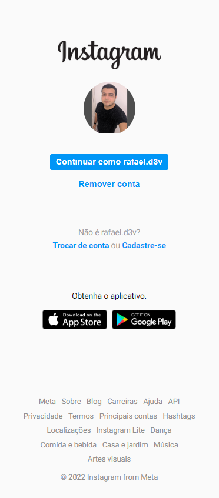
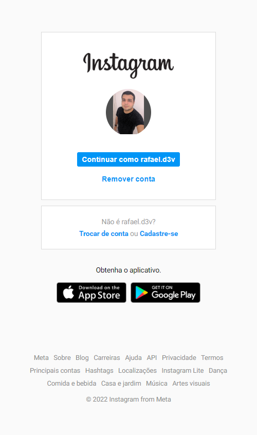
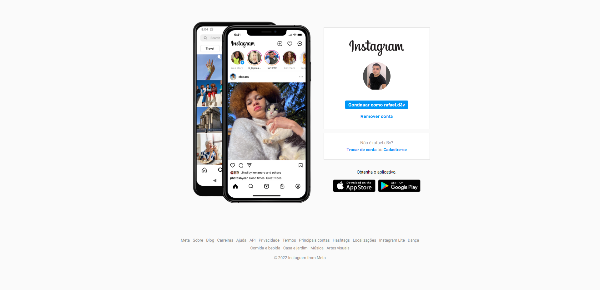

# Recriação da página inicial do instagram    
&nbsp;
     
&nbsp;

#### Sobre o projeto:
Esse projeto é uma recriação da página inicial do instagram web. Ele foi feito como um exeercício do bootcamp da empresa Spread na plataforma da Digital Innovation One. 
&nbsp;

[Clique aqui para visualizar o projeto](https://rafad3v.github.io/login-instagram-page/)
&nbsp;

#### Tecnologias utilizadas:
* HTML
* CSS
&nbsp;

#### Imagens do projeto:

&nbsp;

&nbsp;

